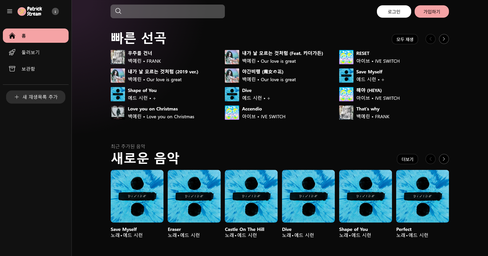
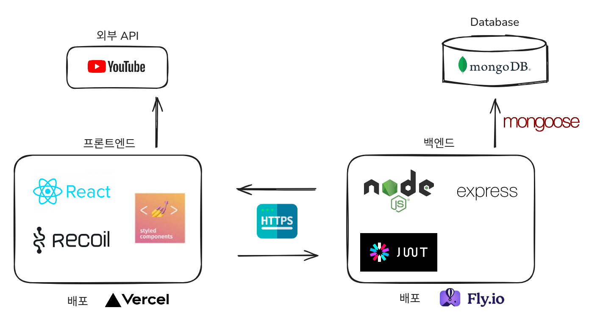

# Patrick Stream

목차

- [프로젝트 소개](#프로젝트-소개)
- [관련 링크](#관련-링크)
- [주요 기능 소개](#주요-기능-소개)
- [개발 주요 로드맵](#개발-주요-로드맵)
- [개발자 정보](#개발자-정보)

 

유튜브 뮤직 웹사이트를 참고해 구조와 주요 기능을 구현한 개인 풀스택 프로젝트입니다.

 

## 프로젝트 소개

### 프로젝트 아키텍처

프로젝트의 아키텍처입니다.
프론트엔드의 배포는 vercel을 사용했습니다. 백엔드의 배포는 fly.io를 사용했으며 Database는 MongoDB를 사용했습니다.

### 프로젝트 라이브러리

프로젝트에 사용된 스킬입니다.
 

#### 프론트엔드

#### 백엔드

 

## 관련 링크

배포 링크 : [https://www.patrickstream.xyz](https://www.patrickstream.xyz)  
프론트엔드 깃허브 링크: [https://github.com/LazyMG/patrick-stream_front](https://github.com/LazyMG/patrick-stream_front)  
백엔드 깃허브 링크: [https://github.com/LazyMG/patrick-stream_back](https://github.com/LazyMG/patrick-stream_back)

 

## 주요 기능 소개

페이지 내에 로그인 기능이 없는 유튜브 뮤직 사이트와 달리 로그인 기능을 구현했습니다.
또한, 콘텐츠 등록과 수정, 삭제가 가능한 관리자 페이지를 별도로 구축하여, 사용자와 관리자 간의 역할을 분리하고 서비스 확장성을 고려한 구조로 개발을 진행했습니다.

사용자는 음악의 재생 및 재생목록에 추가, 삭제 기능을 사용할 수 있습니다.
좋아하는 음악, 아티스트, 앨범, 재생목록을 표시할 수 있습니다.
음악 제어 기능인 재생과 일시정지, 다음 및 이전 곡 재생, 볼륨 조절이 가능합니다.

 

## 개발 주요 로드맵

- [x] 음악 재생 및 재생목록 추가 기능 구현
- [x] 모바일 브라우저 대응
- [ ] 관리자 페이지 반응형 구현
- [ ] 댓글 기능 구현
- [ ] 음악 개별 페이지 구현

 

## 개발자 정보

이마가: 풀스택 개발  
✉️ 이메일: cbfmark@gmail.com  
🏠 블로그: [https://velog.io/@cbfmark/posts](https://velog.io/@cbfmark/posts)
